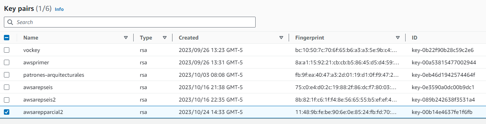

# CONJETURA DE COLLATZ EN LA NUBE
Una aplicacion web desplegada en AWS usando EC2 y Docker:

Collatz es un servicio REST que recibe una cadena, y responde en un objeto JSON con la secuencia de numeros de Collatz generada a partir del numero.

## Instrucciones para ejecutar

### Local (utilizando Docker)

Paso a paso

```
1. Bajar el .ZIP del repositorio.

2. Extraer el archivo comprimido.

3. Abrir el Shell.

4. Desde el Shell, muevase a la ubicacion donde extrajo el archivo .ZIP (Deberia estar dentro de la carpeta llamada  "AREP-PARCIAL2-master").

5. Escriba "mvn clean install".

6. Abra Docker.

7. Escriba "docker-compose up -d" desde el shell para desplegarlo en Docker.

8. Abra su navegador web de y busque en una pestaña incognita:
   
   - "localhost:4567" - Cliente web.
   - "localhost:4567/collatz?value=*numero a calcular collatz*" - Servicio GET

```

### Despliegue en AWS

```

1. Lanzar instancia (Nombrar la instacia y su keypair).

2. Conectarse a la instancia por medio de su DNS Publico y un cliente SSH, estando ubicado sobre el directorio donde esta su clave par:

   En mi caso: ssh -i "awsarepparcial2.pem" ec2-user@ec2-54-80-106-129.compute-1.amazonaws.com

3. Actualizar: sudo yum update -y

4. Ajustar  grupos de seguridad (reglas de acceso a los puertos necesarios):

5. Desde la maquina virtual, ejecute lo siguiente:

   a) Instalar docker:

      sudo yum update -y
      sudo yum install docker

   b) Iniciar el servicio Docker: sudo service docker start

   c) Configurar su usuario en el grupo de docker para no tener que ingresar “sudo” cada vez que invoca un comando: sudo usermod -a -G docker ec2-user

6. Desconectese de la máquina virtual e ingrese nuevamente para que la configuración de grupos de usuarios tenga efecto.

7. Desde la EC2, cree una instancia de un contenedor docker independiente de la consola (opción “-d”) y con el puerto 6000 enlazado a un puerto físico de su máquina (opción -p), a partir de la imagen creada en mi Dockerhub:

   docker run -d -p 42000:6000 --name firstdockerimageaws dnielben/firstsprkwebapprepo

8. Accede en una url similar a esta (la url específica depende de los valores de su maquina virtual EC2) a la aplicacion web:

   http://ec2-54-80-106-129.compute-1.amazonaws.com:35000

```

## Evaluacion

Pruebas de app web funcionando:

Cliente web desde Docker:


Servicio GET desde Docker:


Prueba de demostracion de despliegue de la aplicacion web realizada utilizando EC2 (AWS):

https://youtu.be/WbD5XdUd9s0


## Implementacion

### Arquitectura

Componentes:

1. **Servidor Web**:
   - Usa Spark para crear un servidor web.
   - `/collatz` recibe las solicitudes GET con un parámetro "value" y devuelve en un objeto JSON con la secuencia de numeros de Collatz generada a partir del numero.

2. **Interfaz de Usuario (HTML/JavaScript)**:
   - Página HTML que contiene un formulario para que el usuario ingrese un numero.
   - Presionar sobre "Submit", corre una función JavaScript que envia el valor del numero a través de la ruta `/collatz`.


### DockerHub


### AWS


Keypair.




Instancia:


Detalles:


Grupo de seguridad:


## Construido con

* [Java](https://www.oracle.com/co/java/) - Backend
* [Maven](https://maven.apache.org/) - Gestion de ciclo de vida, codigo fuente y dependencias
* [Git/Github](https://git-scm.com/) - Control de versiones
* [IntelliJ IDEA](https://www.jetbrains.com/idea/) - IDE 
* [Docker](https://www.docker.com/products/docker-hub/) - Virtualizar

## Autores

* **Juan Francisco Teran** - *Trabajo total* - [TeranRyl](https://github.com/TeranRyl)

## Licencia

Este proyecto tiene la licencia GNU General Public License v3.0; consulte el archivo [LICENSE](LICENSE.txt) para obtener más información.

## Reconocimientos

* PurpleBooth - Plantilla para hacer un buen README
* Luis Daniel Benavides - Preparacion para el examen

